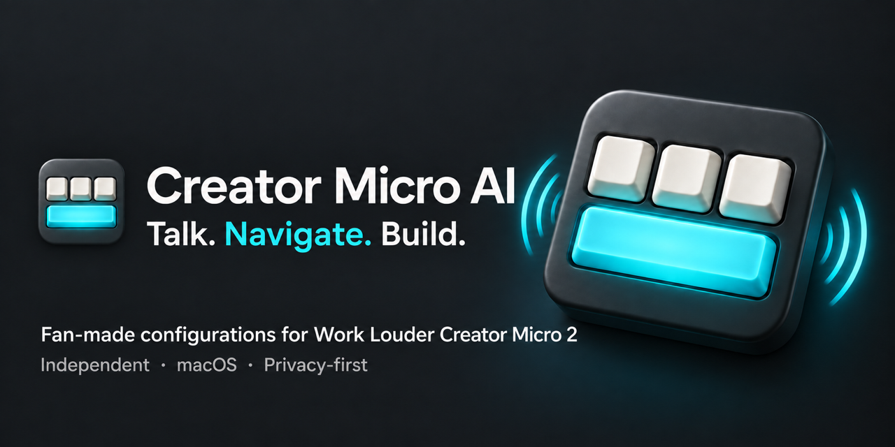
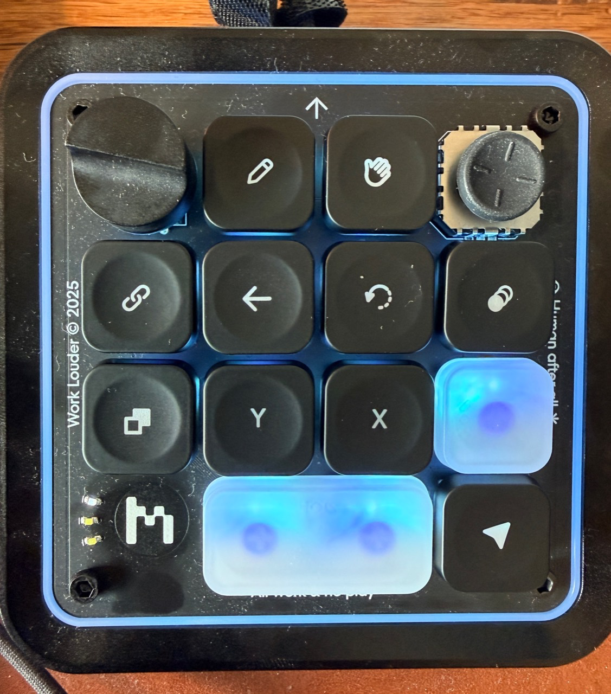

# Creator Micro AI

**A fan-made configuration kit for Work Louder's Creator Micro 2.**



Work Louder built a fantastic tactile platform. This project builds on it: a shared set of controls for talking to AI, navigating conversations, approving individual actions and switching between desktop workspaces. It is a configuration and companion-helper project, not replacement firmware or a replacement for Input.

Start with the [Creator Micro 2 from Work Louder](https://worklouder.cc/creator-micro-2). You still need the hardware and Work Louder's Input app. This is an independent enthusiast project, not an official, sponsored or endorsed Work Louder release. Vendor names belong to their respective owners. This kit does not distribute firmware or Input software.

## Four layers, one muscle memory

| Layer | Workspace brought forward |
| --- | --- |
| 1 | Codex inside ChatGPT desktop |
| 2 | Chat inside ChatGPT desktop |
| 3 | Code inside Claude desktop |
| 4 | Chat inside Claude desktop |

These are desktop views, not the Codex CLI or Claude Code CLI. A standalone Codex app is not a tested target. Desktop updates can change the shortcuts and accessibility labels this helper relies on.

The wide key toggles Superwhisper dictation. The key beside it submits. Other keys keep the same jobs on every layer: context `@`, Backspace, Undo, model picker, Copy response, Allow once, Deny and newline. Turn the dial for arrow navigation; press it for search.

**Actions follow the foreground app, not the layer.** Changing layers switches the app/view. If you then click into another supported app, Copy response and approval keys act there. They do not drag you back to the layer's app.

See the [interactive side-by-side layout](https://veteranbv.github.io/creator-micro-ai/), [setup guide](docs/setup.md), [gotchas](docs/gotchas.md), and [physical test checklist](docs/verification.md).

### The physical layout



USB cable at the top. The interactive reference pairs these exact key positions with their actions. The wide clear bar is dictation; the clear key above Submit is newline.

## Status

This is a pre-release, source-built kit. Automated tests cover the profile, action-selection rules, shortcut construction and privacy checks. Physical acceptance of this source build is still pending. Use the [verification checklist](docs/verification.md) before relying on it for daily use.

## Build and test

Use macOS with Xcode Command Line Tools, Node 22 or newer for development tests, and Python 3.10 or newer. No npm install, API key, cloud service or paid AI account is required to build this helper. Target apps and dictation services have their own requirements.

```sh
bash scripts/test.sh
bash scripts/build.sh
```

The build creates `build/Creator Micro AI.app` without launching it, altering Accessibility permissions or writing the device. Source builds use ad-hoc signing. They are not notarized downloads.

## Privacy first

No keystroke recorder, clipboard reader, audio recorder, analytics, background upload or runtime action log. The helper registers only five reserved controller shortcuts and examines supported apps' accessibility controls in memory. Some accessibility labels can contain conversation text; those labels are not persisted or transmitted. The USB bridge communicates through private inherited pipes, not a listening network port.

Superwhisper and the AI apps process your voice/text separately under their own settings. This project does not make those services offline or change their privacy policies. Read [PRIVACY.md](PRIVACY.md).

## Development

See [CONTRIBUTING.md](CONTRIBUTING.md) and [repository administration](docs/repository-admin.md) for tests, Codex review, branch protection and publication checks.
