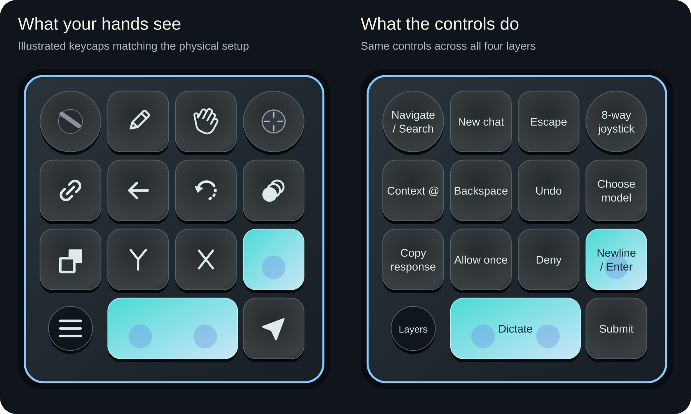

# Creator Micro AI

**A fan-made configuration kit for Work Louder's Creator Micro 2.**


Work Louder built a fantastic tactile platform. This project builds on it: a shared set of controls for talking to AI, navigating conversations, approving individual actions and switching between desktop workspaces. It is a configuration and companion-helper project, not replacement firmware or a replacement for Input.

Start with the [Creator Micro 2 from Work Louder](https://worklouder.cc/creator-micro-2). You still need the hardware and Work Louder's Input app. This is an independent enthusiast project, not an official, sponsored or endorsed Work Louder release. Vendor names belong to their respective owners. This kit does not distribute firmware or Input software.

[Watch the 99-second controller demo](https://veteranbv.github.io/creator-micro-ai/demo.html), with captions and a downloadable video.

## Four layers, one muscle memory

| Layer | Workspace brought forward |
| --- | --- |
| 1 | Codex inside ChatGPT desktop |
| 2 | Chat inside ChatGPT desktop |
| 3 | Code inside Claude desktop |
| 4 | Chat inside Claude desktop |

These are desktop views, not the Codex CLI or Claude Code CLI. A standalone Codex app is not a tested target. Desktop updates can change the shortcuts and accessibility labels this helper relies on.

The wide key sends Control+Shift+D to your configured dictation tool. The key beside it submits. Other keys keep the same jobs on every layer: context `@`, Backspace, Undo, model picker, Copy response, Allow once, Deny and Shift+Return (⇧ ↵). Turn the dial for arrow navigation; press it for search.

**Actions follow the foreground app, not the layer.** Changing layers switches the app/view. If you then click into another supported app, Copy response and approval keys act there. They do not drag you back to the layer's app.

See the [interactive side-by-side layout](https://veteranbv.github.io/creator-micro-ai/), [setup guide](docs/setup.md), [gotchas](docs/gotchas.md), and [physical test checklist](docs/verification.md).

The companion app includes guided setup for app compatibility, both macOS permissions, safe profile configuration, dictation and physical tests. Reopen Creator Micro AI from Applications to see **Setup & Status**. The control reference is also bundled for offline use. macOS permission approvals remain yours to grant.

## Get started

Check [GitHub Releases](https://github.com/veteranbv/creator-micro-ai/releases) for a published, signed pre-release and its verification notes. Download the attached app ZIP, not GitHub's **Source code** archive. If no release is published, use the source-build instructions below.

Follow [Install a signed download](docs/setup.md#install-a-signed-download), then complete the app's guided setup. You still need compatible Work Louder Input and desktop apps. A signed download does not require Xcode, Node, Python or jq to install; those tools are for development.

### The physical layout



The real device, shown separately for reference:


USB cable at the top. The interactive reference pairs these exact key positions with their actions. The wide clear bar is dictation; the clear key above Submit is labeled ⇧ ↵. It sends Shift+Return: a newline in supported composers, or activation of a focused control if the app accepts that shortcut. Submit sends plain Return.

## Choose your dictation tool

Configure your preferred dictation tool to use Control+Shift+D as its global start/stop shortcut. This is the kit's recommended convention, not a universal standard. The tool needs to start recording on one tap, stop on another, and insert the result into the focused app.

Superwhisper is my choice for this setup and the tool used in dictation testing. The kit does not call Superwhisper directly or require it to be installed. Other tools need their own verification across the four workspaces. A hold-to-talk-only tool is not a direct match for this tap-to-toggle profile.

## Status

This is a pre-release kit. Version 0.2.3 build 8 is Developer ID-signed and notarized, with user-reported Copy-response passes in all four layers over USB and Bluetooth. Its controlled update retained both permissions. Earlier builds have separate switching and all-control results; they are not a complete retest of every control on build 8. Automated tests cover the profile, action-selection rules, shortcut construction and privacy checks. See the [verification checklist](docs/verification.md) for exact builds, evidence and remaining checks.

A native device-bridge crash during extended use remains under investigation. The current helper includes process-isolated reconnection and bounded restart delays, with automated failure-path coverage. Recovery after manually choosing Reopen is not an automatic-recovery pass. Hardware recovery, sustained-use acceptance and second-Mac compatibility remain unverified.

Bluetooth power-cycle/reconnect testing also has a user-reported pass on the earlier checkpoint recorded there. Follow the [Bluetooth setup steps](docs/setup.md#bluetooth-operation); profile writes remain USB-only until separately tested.

## Build and test

Use macOS with Xcode Command Line Tools, Node 22 or newer for development tests, Python 3.10 or newer, and jq available on PATH. No npm install, API key, cloud service or paid AI account is required to build this helper. Target apps and dictation services have their own requirements.

```sh
bash scripts/test.sh
bash scripts/build.sh
```

The build creates `build/Creator Micro AI.app` without launching it, altering Accessibility permissions or writing the device. Source builds use ad-hoc signing. They are not notarized downloads.

Maintainers can use the [local signed release workflow](docs/releases.md) to build a
universal, Developer ID-signed and notarized ZIP. Signing keys stay on the signing Mac;
GitHub tests do not need credentials.

## Privacy first

No keystroke recorder, clipboard reader, audio recorder, analytics, background upload or runtime action log. The helper registers only five reserved controller shortcuts and examines supported apps' accessibility controls in memory. Some accessibility labels can contain conversation text; those labels are not persisted or transmitted. The USB bridge communicates through private inherited pipes, not a listening network port.

Your chosen dictation tool and the AI apps process your voice/text separately under their own settings. This project does not make those services offline or change their privacy policies. Read [PRIVACY.md](PRIVACY.md).

## Development

See [CONTRIBUTING.md](CONTRIBUTING.md) and [repository administration](docs/repository-admin.md) for tests, Codex review, branch protection and publication checks.
